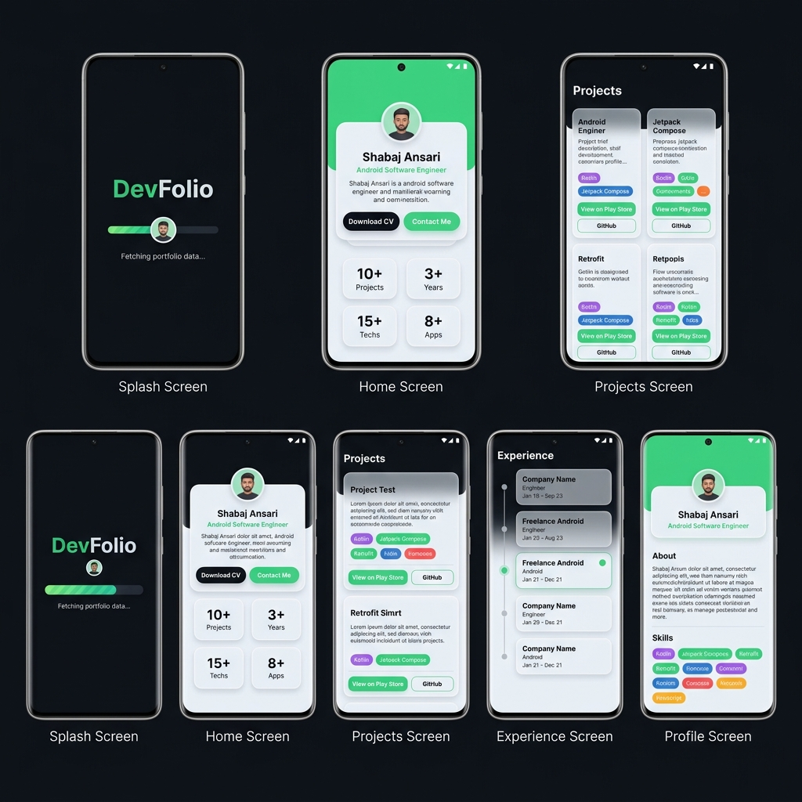
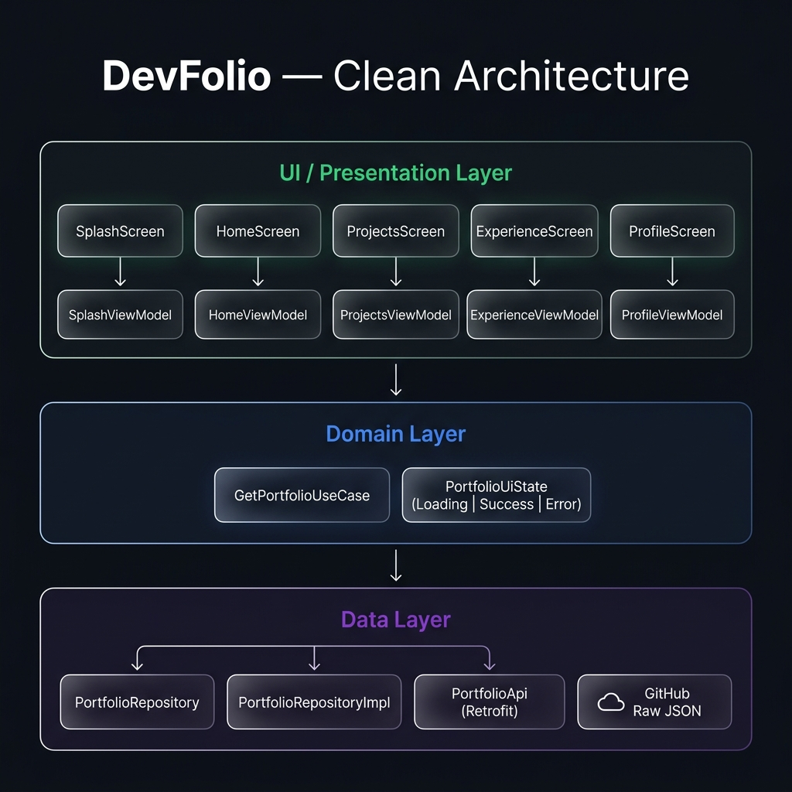

<div align="center">

# 🚀 DevFolio

**A premium Android portfolio application built with Jetpack Compose & Clean Architecture**

*Showcasing modern Android development practices, a custom Claymorphism design system, and live remote data integration.*

[](https://kotlinlang.org)
[](https://developer.android.com/jetpack/compose)
[](https://developer.android.com/about/versions/nougat)
[](https://developer.android.com)
[](LICENSE)

</div>

---

## 📸 Screenshots



> *Splash → Home → Projects → Experience → Profile — all powered by live remote data*

---

## ✨ Features

| Feature | Description |
|---------|-------------|
| 🎨 **Claymorphism UI** | Custom design system with soft clay-style cards, depth shadows, and glassmorphism effects |
| ⚡ **Animated Splash** | Progress bar with real-time status updates while fetching portfolio data |
| 🏠 **Dynamic Home** | Hero card, animated stat counters, tech stack chips, featured project, achievements |
| 📁 **Projects Showcase** | Filterable project grid with tech tags, Play Store & GitHub deep links |
| 🗓️ **Experience Timeline** | Vertical timeline of work history with active role indicators |
| 👤 **Profile Screen** | Full bio, aggregated skills chips, resume download, contact sheet |
| 📬 **Contact Bottom Sheet** | One-tap Email, LinkedIn, GitHub, WhatsApp, and Phone Dialer intents |
| 🌙 **Dark Mode** | Full dark/light theme support respecting the Claymorphism language |
| 🔄 **Live Remote Data** | Portfolio data fetched from GitHub via Retrofit — update JSON to update the app |
| 💾 **In-Memory Cache** | Data fetched once on splash and shared across all screens |
| 🏗️ **Clean Architecture** | Strict separation into Presentation, Domain, and Data layers |

---

## 📐 Architecture



The app follows **Clean Architecture** with strict layer boundaries:

```
UI (Compose Screens)
    └── ViewModels (StateFlow)
            └── GetPortfolioUseCase (Domain)
                    └── PortfolioRepository (Interface)
                            └── PortfolioRepositoryImpl
                                    └── PortfolioApi (Retrofit)
                                            └── GitHub Raw JSON
```

### Layer Breakdown

#### 🟢 Presentation Layer (`features/`)
Each feature is self-contained with its own `Screen.kt` and `ViewModel.kt`:
- `SplashScreen` + `SplashViewModel` — animated loading with real-time progress
- `HomeScreen` + `HomeViewModel` — hero, stats, core stack, featured project
- `ProjectsScreen` + `ProjectsViewModel` — filterable project grid
- `ExperienceScreen` + `ExperienceViewModel` — career & education timeline
- `ProfileScreen` + `ProfileViewModel` — bio, skills, contact

#### 🔵 Domain Layer (`core/domain/`)
- `GetPortfolioUseCase` — single source of truth for fetching the portfolio
- `PortfolioUiState` — sealed class: `Loading`, `Success(data)`, `Error(message)`

#### 🟣 Data Layer (`core/network/`)
- `PortfolioApi` — Retrofit interface pointing to GitHub raw JSON
- `PortfolioRepositoryImpl` — fetches from network, caches result in memory
- `PortfolioModels.kt` — Kotlin data classes mirroring the JSON schema

#### 🔧 Dependency Injection (`di/`)
Manual DI via `AppContainer` / `DefaultAppContainer` exposed on `DevFolioApplication`.
No Hilt or Koin — zero annotation processing overhead.

---

## 🛠️ Tech Stack

| Category | Library / Tool |
|----------|---------------|
| Language | Kotlin 2.x |
| UI | Jetpack Compose + Material 3 |
| Architecture | MVVM + Clean Architecture |
| Async | Kotlin Coroutines + Flow |
| Networking | Retrofit 2 + Gson Converter |
| Image Loading | Coil 2 (AsyncImage) |
| Navigation | Navigation Compose |
| State | StateFlow + collectAsState |
| DI | Manual (AppContainer) |
| Build System | Gradle KTS |

---

## 📂 Project Structure

```
DevFolio/
├── app/src/main/java/com/sbz/devfolio/
│   ├── DevFolioApplication.kt        # Application class, wires AppContainer
│   ├── MainActivity.kt               # Entry point, hosts NavHost
│   ├── di/
│   │   └── AppContainer.kt           # Manual dependency injection container
│   ├── core/
│   │   ├── designsystem/
│   │   │   └── components/           # All reusable Clay* components
│   │   ├── domain/
│   │   │   ├── model/                # PortfolioUiState sealed class
│   │   │   └── usecase/              # GetPortfolioUseCase
│   │   ├── navigation/               # Screen routes + bottom nav config
│   │   ├── network/
│   │   │   ├── api/                  # PortfolioApi (Retrofit interface)
│   │   │   ├── model/                # PortfolioResponse data classes
│   │   │   └── repository/           # PortfolioRepository + Impl
│   │   └── utils/                    # ResumeDownloader, etc.
│   └── features/
│       ├── splash/                   # SplashScreen + ViewModel + UiState
│       ├── home/                     # HomeScreen + ViewModel
│       ├── projects/                 # ProjectsScreen + ViewModel
│       ├── experience/               # ExperienceScreen + ViewModel
│       ├── profile/                  # ProfileScreen + ViewModel
│       ├── main/                     # MainScreen (bottom nav host)
│       └── more/                     # MoreScreen
└── screenshots/
    ├── screens.png
    └── architecture.png
```

---

## 🎨 Design System

The `core/designsystem/components/` module is the single source of truth for all visual components, built around a **Claymorphism** aesthetic:

| Component | Description |
|-----------|-------------|
| `ClayCard` | Base card with soft elevation, rounded corners and clay surface modifier |
| `ClayHeroCard` | Full hero section with floating avatar, name, title, CTA buttons |
| `ClayButton` | Pressable button with `clayPressed` haptic feel modifier |
| `ClayStatCard` | Animated number counter card |
| `ClayProjectCard` | Project card with image, description, tech chips and action buttons |
| `ClayTimelineCard` | Timeline node card for experience section |
| `ClayTechChip` | Rounded skill/tag chip |
| `ClayAchievementCard` | Achievement highlight card |
| `ClaySectionHeader` | Consistent page heading with icon + subtitle |
| `ClayBottomNavigation` | Floating bottom navigation bar |
| `ContactBottomSheet` | Modal sheet with all contact options |
| `ClayLoadingState` | Centered loading indicator |
| `ClayErrorState` | Error state with retry button |
| `BackgroundGlow` | Soft radial gradient ambient glow |

---

## 🌐 Remote Data

Portfolio data is served from a GitHub raw JSON file. To personalise this app:

1. Fork or create a new repository on GitHub
2. Add a `data.json` file matching the schema below
3. Update `PortfolioApi.kt` to point to your raw URL:

```kotlin
@GET("YOUR_USERNAME/YOUR_REPO/refs/heads/main/data.json")
suspend fun getPortfolioData(): PortfolioResponse
```

### JSON Schema

```json
{
  "profile": {
    "name": "Your Name",
    "title": "Your Title",
    "location": "City, Country",
    "phone": "+00 0000000000",
    "email": "you@example.com",
    "summary": "Your bio...",
    "experienceYears": 3,
    "avatarUrl": "",
    "resumeUrl": "",
    "tagline": "Your tagline",
    "availableFor": ["Android Development", "Freelance Projects"]
  },
  "stats": {
    "yearsExperience": 3,
    "projectsCompleted": 10,
    "technologiesUsed": 15,
    "appsWorkedOn": 8
  },
  "skills": {
    "languages": ["Kotlin", "Java"],
    "android": ["Jetpack Compose", "MVVM", "Room"],
    "networking": ["Retrofit", "OkHttp"],
    "firebase": ["Firestore", "FCM"],
    "monetization": ["AdMob"],
    "tools": ["Android Studio", "Git", "Figma"]
  },
  "experience": [...],
  "featuredProject": { ... },
  "projects": [...],
  "achievements": [...],
  "education": [...],
  "socialLinks": {
    "email": "you@example.com",
    "phone": "+00 0000000000",
    "linkedin": "https://linkedin.com/in/you",
    "github": "https://github.com/you"
  }
}
```

---

## 🚀 Getting Started

### Prerequisites
- Android Studio Hedgehog or later
- JDK 11+
- Android device or emulator (API 24+)

### Run the App

```bash
# 1. Clone the repository
git clone https://github.com/SHabaj-dev/DevFolio.git

# 2. Open in Android Studio
# File → Open → select the DevFolio folder

# 3. Sync Gradle (Android Studio will prompt automatically)

# 4. Run on emulator or device
# Run → Run 'app'  (or Shift+F10)
```

> **Note:** Requires an active internet connection on first launch to fetch portfolio data from GitHub. Subsequent launches use the in-memory cache.

---

## 🤝 Contributing

Contributions, issues, and feature requests are welcome! Feel free to:

1. Fork the repository
2. Create your feature branch: `git checkout -b feature/amazing-feature`
3. Commit your changes: `git commit -m 'Add amazing feature'`
4. Push to the branch: `git push origin feature/amazing-feature`
5. Open a Pull Request

---

## 📄 License

This project is open-source and available under the [MIT License](LICENSE).

---

<div align="center">

**Made with ❤️ by [Shabaj Ansari](https://github.com/SHabaj-dev)**

*Android Software Engineer · Noida, India*

</div>
